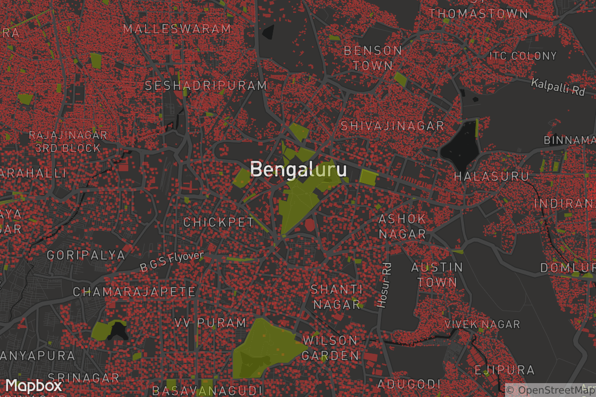

**Goal**: Extract buildings and parks in bangalore and make a map.



Bounding box: `[77.4368, 12.8225, 77.7564, 13.0939]`

feature | count | area
---------- | -------- | -----
buildings | 581,624 | 84,255,096.14 (m²)
parks | 621 | 6,918,199.09 (m²)

## Setup

Download india extract from [osm-qa-tiles](http://osmlab.github.io/osm-qa-tiles/) and place it in `data`.

Install [tippecanoe](https://github.com/mapbox/tippecanoe) for processing geojsons.

```
brew install tippecanoe
```

## Counts and area

Process `india.mbtiles` using tile-reduce.

Individual scripts are used for each task:

- [Count buildings](/scripts/countBuildings)
- [Count parks](/scripts/countParks)
- [Area of buildings](/scripts/areaOfBuildings)
- [Area of parks](/scripts/areaOfParks)

Area of features is calculated using [turf.area](http://turfjs.org/docs/#area).

## Extract data

The [featureFilter](/scripts/featureFilter) script extracts out all buildings (polygons with `building=yes`) and parks (polygons with `leisure=park`). Pipe the output to tippecanoe to create mbtiles.

```
node scripts/featureFilter | tippecanoe -o data/buildings-and-parks.mbtiles -z 12 -Z 12
```

The `featureFilter` script uses the `feature-filter` module to write filters complying to [Mapbox GL style spec](https://www.mapbox.com/mapbox-gl-style-spec/#types-filter).

```js
var filter = [
  "all",
  ["==", "$type", "Polygon"],
  ["any",
    ["==", "building", "yes"],
    ["==", "leisure", "park"]
  ]
];
```

The `feature-filter` module expects the feature types to be indexes. A simple workaround is used to change types in the feature geojson.

```js
function geojsonFilter(featureFilter) {
  var types = ['Unknown', 'Point', 'LineString', 'Polygon'];

  return function(feature) {
    var layerFeature = Object.assign({}, feature);
    layerFeature.type = types.indexOf(layerFeature.geometry.type);
    return featureFilter(layerFeature);
  }
}
```

## Upload and style

The [upload](/scripts/upload.js) script uploads the tileset to Mapbox. Add your `username` and `accesstoken` in the configuration.

```js
var progress = upload({
  file: path.join(__dirname, "../data/buildings-and-parks.mbtiles"),
  account: "<username>",
  accesstoken: "<accesstoken>",
  mapid: "<username>.<tileset>"
});
```

Style the map using [Mapbox Studio](https://www.mapbox.com/studio) and create a static image using the [Mapbox Static API](https://www.mapbox.com/api-documentation/#static).
